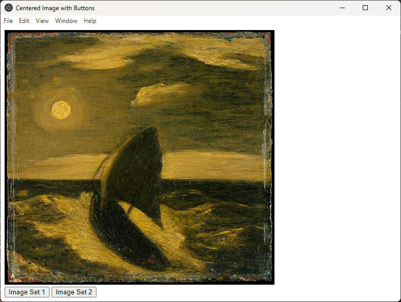

A tool to help with binary classification of data, written in electron.



This app uses the Met's open data access API (https://github.com/metmuseum/openaccess and api at https://metmuseum.github.io/) as a sample source of images.  The user clicks the buttons in the app to sift images into 2 categories. 

To run this app:
* clone the repo
* download https://collectionapi.metmuseum.org/public/collection/v1/search?q=Composition to src/data.ts. Prepend it with ```export const allData =``` to make a valid variable.  It should look like:

```
export const allData = {"total":9556,"objectIDs":[844978,490012,485821,207021,848032,481743,485904,482376]}
```

But with more data in the array.  Feel free to alter "Composition" to another query per the API (https://metmuseum.github.io/#search)

TODO:
* Figure out how to write the sifted data to disk
* secure the script-src CSP header
* fetch the collection data from the API, rather than a big file on disk
* filter out missing preview images (or continue finding the next random number)